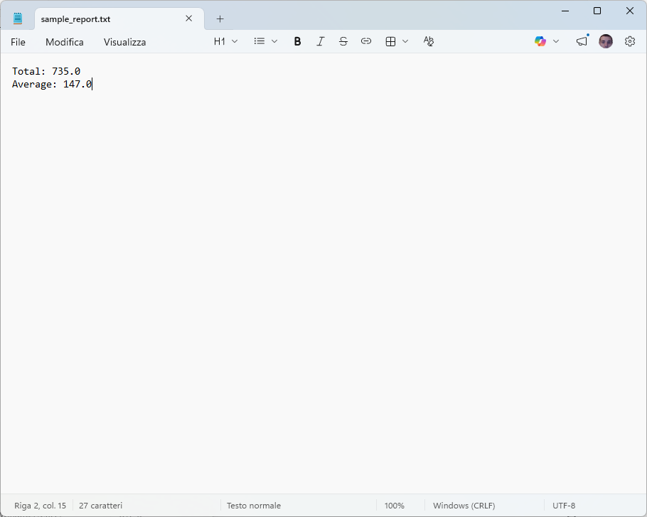

# 1-Click Report Generator (CSV → Summary Report)

## 🚀 Overview
Manually analyzing CSV data takes time and is error-prone.

This tool automatically processes your CSV file and generates a clean summary report in seconds.

Perfect for:
- Small business owners
- Freelancers
- Anyone working with exported data

---

## ✅ Features
- Cleans input data (removes empty rows)
- Calculates totals and averages
- Generates a simple, readable report
- Works with any basic CSV file

---

## 📂 Example

### Input (CSV)
date,sales
2024-01-01,100
2024-01-02,200

### Output
Total Sales: 300
Average Sales: 150

---

## ⚙️ How to Use

1. Place your CSV file in the project folder
2. Run:

```bash
python main.py input.csv
```

3. Your report will be generated in the `output/` folder

---

## 🧠 Why This Tool?

Instead of spending time manually processing data, this tool does it instantly—saving hours of repetitive work.

---

## 🔧 Requirements
- Python 3.x

(No external libraries required)

---

## 📌 Notes
- CSV should contain numeric values in the second column
- Simple structure works best for this version

---

## 💡 Future Improvements
- Charts and graphs
- PDF export
- Multi-column support


## 📸 Example Output


